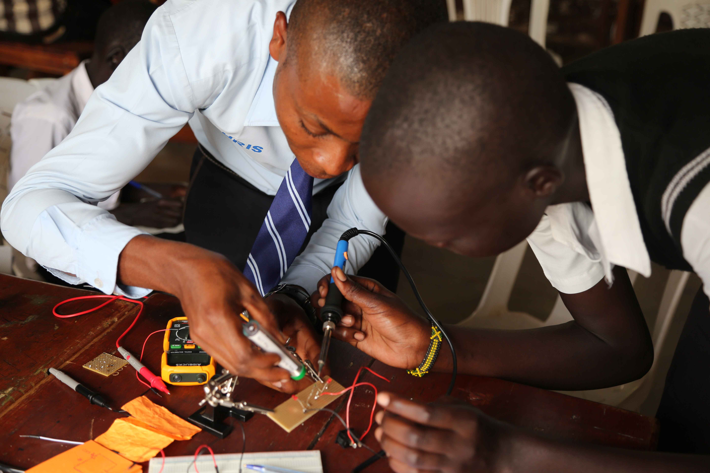
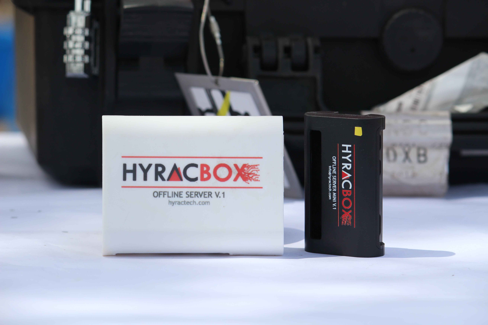
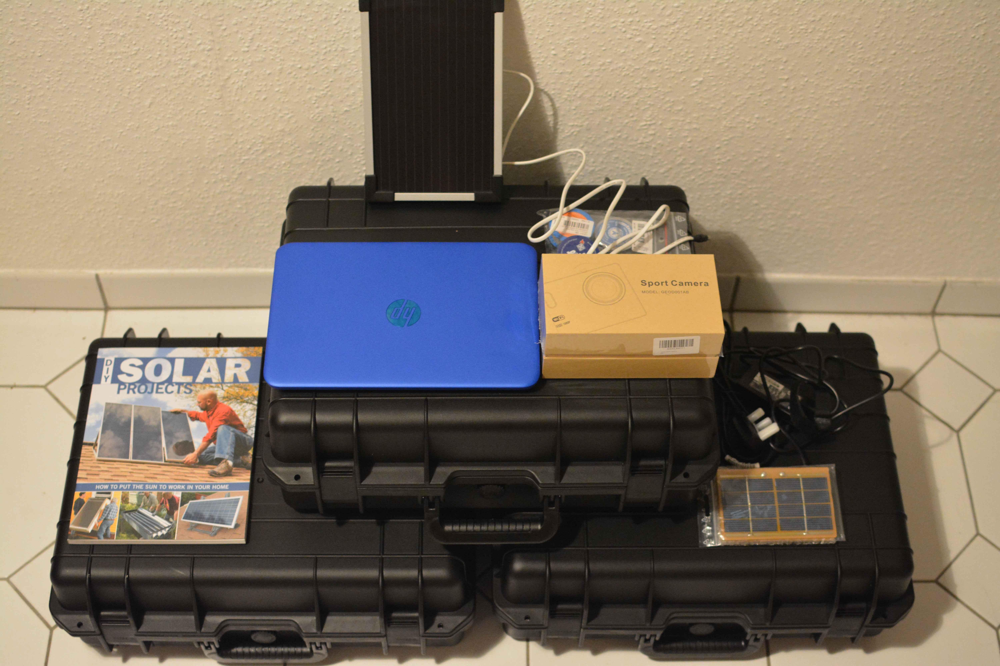

# #ASKotec

[#ASKotec](https://openculture.agency/outcomes/askotec/);
the *Access to Skills and Knowledge Open Tech Emergency Case* is a resource kit for community trainers,
created for mobile field-use where there is neither easy power nor internet connectivity such as refugee camps,
low-infrastructure regions or rural areas.
Intended as _Open Tech for Good_, #ASKotec was created through a series of hub development workshops
by a community of young innovators intent on bringing skills training and peace-building together
in the effort to end the South Sudan conflict.




## Tutorials

- [ASKnet Open Tech](https://wikifab.org/wiki/Group:ASKnet_Open_Tech#Tutorials) (wikifab)

## Costs

(for details, see the NEW content list)

|         | Costs
--------- | ---
Tools     | 650,00 €
Materials | 200,00 €
Total     | ~ 950 €

- Support us: crowdfunding at <https://www.betterplace.org/en/projects/63347>




A new part just added before the release:

- Learn about [hyracbox.com](https://www.hyracbox.com/),
  developed by our project partners at
  [Hyractech](https://github.com/HyracTech)

## Public Relation

- <https://audioboom.com/posts/6697512-hardware-and-innovations-workshop-opens-in-juba>

## FAQ

### What is ASKotec?

The #ASKotec is a kit designed to work as a mobile trainers set
to tackle basic field challenges when it comes to Open Tech and Open Source Hardware innovation, education and repairing wherever needed.
Providing *Access to Skills and Knowledge* as a multi-functional *Open Tech Emergency Case*
gives rural and urban innovators a new point of entrance.

- <https://openculture.agency/askotec/>


### What can ASKotec be used for?

- repair cafes
- vocational training in tech, electronics, robotics, innovation, ...
- ... and more


### Where can ASKotec be used?

- designed for post-conflict and post-disaster regions
- schools and communities in remote regions
- ... and many more

### How to get the whole projects data?

If you have `git` installed, you can get the data with the command
`git clone --recurse-submodules https://github.com/opencultureagency/ASKotec.git`.

## Open Hardware Links and Open Linux Software

For links, see the [Open Learning Guide (2015)](
https://github.com/opencultureagency/Open-Learning-Guide)
and the following resources.

### RESOURCES

- OPEN TECH, OPEN HARDWARE + ELECTRONICS

- MOZILLA WEB LITERACY\
  <https://learning.mozilla.org/en-US/web-literacy>\
  Web literacy 21st Century Skills:
  Problem-Solving, Communication, Creativity, Collaboration.
  Share, design, code, compose, remix, navigate, connect, open practice, contribute.

- OPEN! METHODS & TOOLS FOR COMMUNITY-BASED PRODUCT DEVELOPMENT\
  <https://opensourcedesign.cc>\
  Current practices of open source product development & concrete guidance
  to support design process efficiency of open source product development projects.

- OPEN SOURCE HARDWARE ASSOCIATION\
  <https://www.oshwa.org/>\
  Open hardware community ensuring technological knowledge is accessible to everyone.
  Collaborative development of technology that serves education,
  environmental sustainability, and human welfare.

- OPEN SOURCE EDUCATION\
  <https://opensource.com/education/13/4/guide-open-source-education>\
  A guide to free and open source education.
  Stories about creating, adopting, and sharing open source solutions.

- AFRIMAKERS\
  <http://www.afrimakers.org>\
  Empowers makers in Africa to develop sustainable projects using rapid prototyping
  to solve local challenges.

- APPROPEDIA\
  <http://www.appropedia.org/Welcome_to_Appropedia>\
  Sharing knowledge to build rich, sustainable lives.

- IFIXIT\
  <https://www.ifixit.com/>\
  The free repair guide for everything, written by everyone.

- INSTRUCTABLES\
  <http://www.instructables.com/>\
  Share what you make with the world,
  and tap into an ever-growing community of creative experts.
  Participate in make-a-thons through the platform.
  Add your own instructables.

- OPEN SOURCE ECOLOGY\
  <http://opensourceecology.org/>\
  Open source industrial machines can be made for a fraction of commercial costs,
  designs shared online free, to create an open source economy which increases innovation
  by open collaboration.

- WIKIFAB\
  <http://wikifab.org/>\
  Open source hardware documentation platform.
  Tutorials to make anything, written by everyone.

- WIKI-HOW\
  <http://www.wikihow.com/>\
  "We're trying to help everyone on the planet learn how to do anything. Join us."

## Open Tech Linux Software Installation

(on a DEB based OS, like Ubuntu or Debian)

Please run:

```bash
sudo apt update
sudo apt upgrade

sudo apt install gdebi software-properties-common libavcodec-extra ffmpeg \
	redshift firefox libreoffice shutter vlc pinta pdfshuffler geogebra \
	darktable gthumb trash-cli gimp inkscape openshot kazam audacity \
	kdenlive freecad librecad fritzing kicad
```

---



