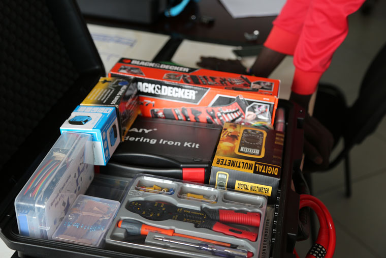

# #ASKotec

(until 2016: "**#ASKote*k*** (kit)"; now: "**#ASKote*c*** (case)")

[#ASKotec](https://openculture.agency/outcomes/askotec/);
the *Access to Skills and Knowledge Open Tech Emergency Case* is a resource kit for community trainers,
created for mobile field-use where there is neither easy power nor internet connectivity such as refugee camps,
low-infrastructure regions or rural areas.
Intended as _Open Tech for Good_, #ASKotec was created through a series of hub development workshops
by a community of young innovators intent on bringing skills training and peace-building together
in the effort to end the South Sudan conflict.


## Costs

|         | Costs
--------- | ---
Tools     | 550,00 €
Materials | 150,00 €
Total     | ~ 700 €




## Open Hardware Links and Open Linux Software

For links, see the [Open Learning Guide (2015)](
https://github.com/opencultureagency/Open-Learning-Guide).

## Open Tech Linux Software Installation

(on a DEB based OS, like Ubuntu or Debian)

Please run:

```bash
sudo apt update
sudo apt upgrade

sudo apt install gdebi software-properties-common libavcodec-extra ffmpeg \
	redshift firefox libreoffice shutter vlc pinta pdfshuffler geogebra \
	darktable gthumb trash-cli gimp inkscape openshot kazam audacity \
	kdenlive freecad librecad fritzing kicad
```

---


