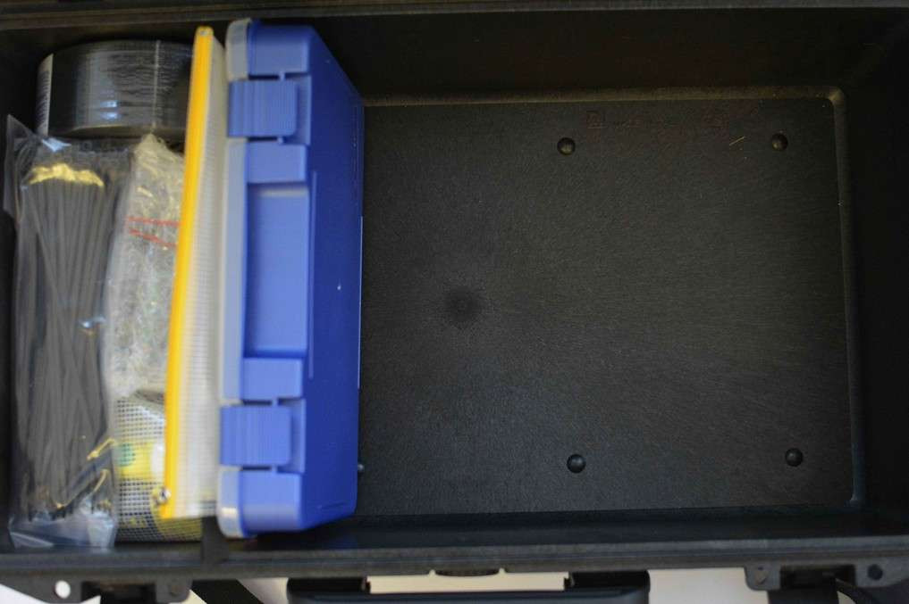

# Packing Guide for #ASKotec v.2.0

The (Un-)Packing Guide is a step by step reference for packing the #ASKotec kit with all its components, it includes descriptions of new elements in this version. This guide can be used for both packing or unpacking the kit, to pack read from bottom-up and to unpack follow in the order of this document.

## #ASKotec outside

 

The #ASKotec is a robust multi-functional kit designed to be capable of working where limited infrastructure exist and thus, as part of our motive to make this kit truly mobile – the #ASKotec V2.0 comes with back straps / harness and rollers to ease on-site mobility and transportation

## #ASKotec lid with items

The inner part of the #Askotec lid has been improved with hook and loop to enable the user access the most imperative and daily used tools and materials by basically attaching them where it’s easy to pick. The items on the hook and loop wall includes the following:

- Linux based laptop
- Scissors
- First Aid Kit
- Calculator
- a pouch
- An amazing askotec tag with a Qr code to the online repository

## #ASKotec lid empty

The first step in the unpacking process is to slowly remove the items attached to the wall of the #ASKotec lid – the loop is soft and fuzzy, we know you’re energetic but you don’t need to use your stamina here

## #ASKotec with items

The design of this version to meant to give the user easy accessibility to tools and materials without the difficulty resulting from random assortment, the blue Arduino box is used as a divide for tools and materials therefore all the items on the right side of the box are tools and the opposite is for materials.

The items on the top layer includes:

- Table cloth for setting tools during training
- Mobile phone repair kit
- Zip bag with open learning guides and reading materials.
- Arduino kit (acts as a divide as well)
- Lock
- Shrink wires kit

To correctly un-/repack this kit follow the below instructions.

## #ASKotec body (Layer 10/10)

Begin by removing / packing the zip back, the lock and the training table cloth

## #ASKotec body (Layer 09/10)

This layer displays the travel bag (the black bag) stowed towards the opening the of the kit and next the zip bags. In case you’re flying, remove this kit since it contains lithium batteries, multi-meters and other materials that are not allowed to be checked into the plane. So, firstly pack / unpack the travel bag followed by the zip bags which contain wires and glue respective fully.

 ## #ASKotec body (Layer 08/10)

The above step above exposes this layer which basically made up of the following tools

- Black and decker tool kit
- Sewing kit
- Zip bag
- Saw bag in red and black

## #ASKotec body (Layer 07/10)

This layer from the side of the tools is composed of zip bag containing sand papers and the red tools + materials kit.

Unpack / pack these items

## #ASKotec body (Layer 06/10)

This picture shows the section of the materials and an empty space where the tools. The materials section contains a shrink tube kit, tiers, solar panels, battery backs, dark tabe, twine and empty boxes to stash prototpes.
To pack / unpack the materials section continue to the steps.

## #ASKotec body (Layer 05/10)

Pack / unpack the shrink tubes kit

## #ASKotec body (Layer 04/10)

 

Pack / unpack the female USBs and the wire rolls

## #ASKotec body (Layer 03/10)

Pack / unpack the solar panels and the battery packs

## #ASKotec body (Layer 02/10)

Pack / unpack the empty prototypes boxes and the dark including the twine which is normally rolled into the middle of the duct tape.

## #ASKotec body (Layer 01/10)

Begin / end by packing or removing the arduiino kit and the zip bag.

## #ASKotec empty

This is your empty kit